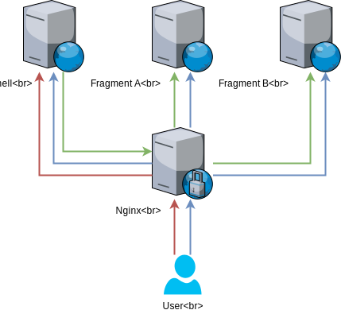

# Remote Modules Example App

## Getting Started

The example app is setup to run in production mode by default. You can start it by running:
```
> docker-compose up -d
```

Then open http://localhost.

To run in development mode:
```
> cd fragment && yarn install && cd -

> cd shell && yarn install && cd -

> docker-compose -f docker-compose.yaml -f docker-compose.development.yaml up -d
```
That's it! Any of the services listed in the [development compose file](docker-compose.development.yaml) will watch your local filesystem for changes. Changes you make locally will be reflected on the container, and the `remote-modules` client will re-fetch on every `import` call.

## High Level Architecture

- User requests `/:fragment` _(red)_
- `Nginx` routes the request to `Shell` _(red)_
- `Shell` makes a remote import call to `Fragment [A/B]` _(green)_
- `Shell` executes the imported modules from `Fragment [A/B]` and returns the rendered page
- Requests for static assets are routed through `Nginx` to the appropriate container _(blue)_

<div align="center">
  <br />
  
</div>
